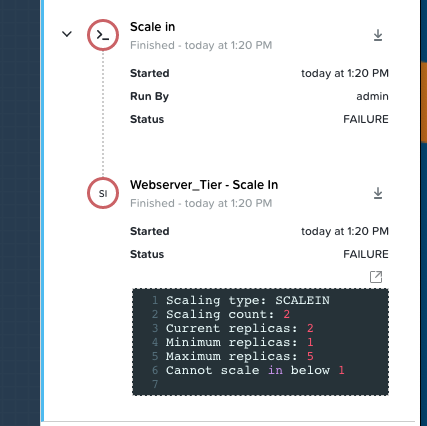

.. _calm_win_multivm:

--------------------------------
Calm: Windows Multi VM Blueprint
--------------------------------

*The estimated time to complete this lab is 60 minutes.*

Overview
++++++++
In this lab you will be creating a Windows MultiVM Blueprint and deploy it as an application. The application you are going to define is the FiestaApp. This simple application consists out of a Webserver and a MSSQL Database server. You also are going to add some actions for Scale-Out and Scale-In, we are going to use HAproxy as a Loadbalancer based on CentOS.

Build the Windows MultiVM Blueprint
+++++++++++++++++++++++++++++++++++

#. In **Prism Central**, select :fa:`bars` **> Services > Calm**

   .. figure:: images/1.png
      :align: center

#. Click |blueprints| 

#. Click the **+ Create Blueprint -> Multi VM/Pod Blueprint**

   .. figure:: images/2.png
      :align: center

#. Provide the following in the fields:

   - **Name** - *Initials*-multivm-Windows
   - **Description** - Optional
   - **Project** - *Initials*-Project

#. Click the **Proceed** button

#. In the left hand side bottom corner click on the :fa:`plus` icon, right to the **Services** text, twice to add two "services".
 
   .. figure:: images/4.png
      :align: center
 
#. This will produce two services on the canvas in the middle of the screen.
 
Database tier - Define the VM
*****************************
 
#. Select **Service1** by clicking it in the left hand bottom corner under **Services**
    
   .. figure:: images/5.png
      :align: center
 
#. In the right hand side navigator, Set the Service name to **Database_Tier**

#. Click, in the right hand side navigator, on **VM**

#. Provide the following in the fields that are shown:
 
   - **Name** - Database_VM
   - **Account** - NTNX_LOCAL_AZ
   - **Operating System** - Windows
   - **Under VM Configuration**

     - **VM Name** - @@{initials}@@-mssql-vm
     - **vCPUs** - 2
     - **Cores per vCPU** - 1
     - **Memory (GB)** - 4
     - **Guest Customization** - enabled 
     - **Type** - Sysprep
     - ** Install Type** - Prepared
     - **Script** - Paste the below code
       
       .. include:: mssql_unattend.xml
          :literal:
       
       .. note::
            Take note of the **@@{initials}@@** text.  In Calm the "@@{" and "}@@" characters represent a macro.  At runtime, Calm will automatically "patch" or substitute in the proper value(s) when it encounters a macro (even in unattend.xml files for Sysprep).  A macro could represent a system defined value, a VM property, or a runtime variable.  Later in this lab we'll create a runtime variables.
            For a full overview off built-in macros that Calm supports look at https://portal.nutanix.com/page/documents/details?targetId=Nutanix-Calm-Admin-Operations-Guide-v3_2_2:nuc-components-macros-overview-c.html 

     - **Disk** - Click the :fa:`plus` icon

       - **Device Type** - Disk
       - **Device Bus** - SCSI
       - **Operation** - Clone from Image Service
       - **Image** - Windows2019.qcow2

       .. figure:: images/6.png
          :align: center
          
     - **Disk** - Click the :fa:`plus` icon

       - **Device Type** - Disk
       - **Device Bus** - SCSI
       - **Operation** - Allocate on Storage COntaienr
       - **Size (GiB)** - 10
     
     - **NETWORK ADAPTERS (NICS)** - Click the :fa:`plus` icon

       - **NIC 1** - Primary
       - **Provate IP** - Dynamic

       .. figure:: images/7.png
          :align: center

     - **CONNECTION**

       - **Check log-in upon create** - enabled
       - **Credential** - Add New Credential

         - **Credential Name** - Administrator
         - **Username** - Administrator
         - **Secret Type** - Password
         - **Password** - Nutanix/4u

         Click the **Done** button

       - **Address** - NIC 1
       - **Connection Type** - Powershell
       - Leave the rest default
       - **Delay (in seconds)** - 120 (this due to the sysprep tasks)
       - **Retries** - 5

       .. figure:: images/8.png
          :align: center

Database tier - Define the packages
***********************************

#. On the top of the right hand side navigation, click **Package**

#. Change **Package Name** to **Install Database**

#. Click **Configure install**
 
#. On the Canvas where you have your services, click the **+ Task** button to create a new Task

   .. figure:: images/9.png
      :align: center

#. Provide the following for the task

   - **Task Name** - Download MSSQL 2019
   - **Type** - Execute
   - **Script Type** - Powershell
   - **Endpoint** - leave blank
   - **Credential** - Select your created Administrator credential
   - **Script** - Copy the below lines into the text area

     .. code-block:: powershell
        
        Write-Host "Getting the ISO image from the image store"
        wget http://10.42.194.11/workshop_staging/SQLServer2019-x64-ENU-Dev.iso -OutFile $env:TEMP\SQLServer2019-x64-ENU-Dev.iso 
     

   .. figure:: images/10.png
        :align: center

#. Click **+ Task** again for the next task

#. Provide the following for the task

   - **Task Name** - Install MSSQL
   - **Type** - Execute
   - **Script Type** - Powershell
   - **Endpoint** - leave blank
   - **Credential** - Select your created admininstrator credential
   - **Script** - Copy the below lines into the text area

     .. code-block:: powershell
        
        $errorOutputFile = "$env:TEMP\ErrorOutput.txt"
        $standardOutputFile = "$env:TEMP\StandardOutput.txt"
        $isolocation="$env:TEMP\SQLServer2019-x64-ENU-Dev.iso"

        $confFile='[OPTIONS]
        IACCEPTPYTHONLICENSETERMS="True"
        IAcceptSQLServerLicenseTerms="True"
        ACTION="Install"
        IACCEPTROPENLICENSETERMS="True"
        SUPPRESSPRIVACYSTATEMENTNOTICE="True"
        ENU="True"
        QUIET="True"
        QUIETSIMPLE="False"
        UpdateEnabled="False"
        USEMICROSOFTUPDATE="False"
        SUPPRESSPAIDEDITIONNOTICE="True"
        FEATURES=SQLENGINE,CONN
        HELP="False"
        INDICATEPROGRESS="False"
        X86="False"
        INSTANCENAME="MSSQLSERVER"
        INSTALLSHAREDDIR="C:\Program Files\Microsoft SQL Server"
        INSTALLSHAREDWOWDIR="C:\Program Files (x86)\Microsoft SQL Server"
        INSTANCEID="MSSQLSERVER"
        SQLTELSVCACCT="NT Service\SQLTELEMETRY"
        SQLTELSVCSTARTUPTYPE="Automatic"
        INSTANCEDIR="C:\Program Files\Microsoft SQL Server"
        AGTSVCACCOUNT="NT Service\SQLSERVERAGENT"
        AGTSVCSTARTUPTYPE="Manual"
        COMMFABRICPORT="0"
        COMMFABRICNETWORKLEVEL="0"
        COMMFABRICENCRYPTION="0"
        MATRIXCMBRICKCOMMPORT="0"
        SQLSVCSTARTUPTYPE="Automatic"
        FILESTREAMLEVEL="0"
        SQLMAXDOP="2"
        ENABLERANU="False"
        SQLCOLLATION="SQL_Latin1_General_CP1_CI_AS"
        SQLSVCACCOUNT="NT Service\MSSQLSERVER"
        SQLSVCINSTANTFILEINIT="False"
        SQLSYSADMINACCOUNTS="Administrator"
        SECURITYMODE="SQL"
        SAPWD="Nutanix/4u"
        SQLTEMPDBFILECOUNT="2"
        SQLTEMPDBFILESIZE="8"
        SQLTEMPDBFILEGROWTH="64"
        SQLTEMPDBLOGFILESIZE="8"
        SQLTEMPDBLOGFILEGROWTH="64"
        ADDCURRENTUSERASSQLADMIN="False"
        TCPENABLED="1"
        NPENABLED="1"
        BROWSERSVCSTARTUPTYPE="Automatic"
        SQLMAXMEMORY="2147483647"
        SQLMINMEMORY="0"
        MEDIALAYOUT="Full"'

        "$confFile" | out-file $env:TEMP\configfile.ini

        Write-Host "Mounting SQL Server Image"
        $drive = Mount-DiskImage -ImagePath $isoLocation

        Write-Host "Getting Disk drive of the mounted image"
        $disks = Get-WmiObject -Class Win32_logicaldisk -Filter "DriveType = '5'"

        foreach ($disk in $disks){
         $driveLetter = $disk.DeviceID
        }

        if ($driveLetter)
        {
         Write-Host "Starting the install of SQL Server"
         Start-Process $driveLetter\Setup.exe "/ConfigurationFile=$env:TEMP\configfile.ini" -Wait -RedirectStandardOutput $standardOutputFile -RedirectStandardError $errorOutputFile
        }

        $standardOutput = Get-Content $standardOutputFile -Delimiter "\r\n"

        Write-Host $standardOutput

        $errorOutput = Get-Content $errorOutputFile -Delimiter "\r\n"

        Write-Host $errorOutput

        Write-Host "Dismounting the drive."

        Dismount-DiskImage -InputObject $drive

        Write-Host "If no red text then SQL Server Successfully Installed!" 
     

#. Click **+ Task** again for the next task

#. Provide the following for the task

   - **Task Name** - Download SQL Management Studio
   - **Type** - Execute
   - **Script Type** - Powershell
   - **Endpoint** - leave blank
   - **Credential** - Select your created root credential
   - **Script** - Copy the below lines into the text area

     .. code-block:: powershell
        
        Write-Host "Downloading MS SQL Management Studio"
        wget https://aka.ms/ssmsfullsetup -OutFile $env:TEMP\SSMS-Setup-ENU.exe

#. Click **+ Task** again for the next task

#. Provide the following for the task

   - **Task Name** - Install SQL Management Studio
   - **Type** - Execute
   - **Script Type** - Powershell
   - **Endpoint** - leave blank
   - **Credential** - Select your created Admininstrator credential
   - **Script** - Copy the below lines into the text area

     .. code-block:: Powershell
        
        $errorOutputFile = "$env:TEMP\ErrorOutput.txt"
        $standardOutputFile = "$env:TEMP\StandardOutput.txt"
        Write-Host "Installing MS SQL Management Studio" 
        Start-Process $env:TEMP\SSMS-Setup-ENU.exe "/install /quiet /norestart" -Wait -RedirectStandardOutput $standardOutputFile -RedirectStandardError $errorOutputFile

#. Click **+ Task** again for the next task

#. Provide the following for the task

   - **Task Name** - Inject FiestaDB data in Database
   - **Type** - Execute
   - **Script Type** - Powershell
   - **Endpoint** - leave blank
   - **Credential** - Select your created Administrator credential
   - **Script** - Copy the below lines into the text area
   
     .. code-block:: powershell
        
         Write-Host "Downloading FiestApp SQL data"
         wget https://github.com/sharonpamela/Fiesta/archive/refs/heads/master.zip -OutFile $env:TEMP\FiestaApp.zip
         
         Write-Host "Unpacking files"
         Expand-Archive -Path $env:TEMP\FiestaApp.zip -DestinationPath $env:TEMP 
         
         Write-Host "Getting the second drive ready"
         $disk_nr=(get-disk | where-object {$_.OperationalStatus -Match "Offline"}).Number
         Initialize-Disk -Number $disk_nr -PassThru
         New-Partition -DiskNumber $disk_nr -UseMaximumSize -DriveLetter E
         Format-Volume -DriveLetter E -FileSystem NTFS -NewFileSystemLabel MSSQL
         mkdir e:\FiestaDB 
         
         Write-Host "Creating the Database on the second drive"
         Invoke-Sqlcmd -Query "CREATE DATABASE FiestaDB ON  PRIMARY ( NAME = N'FiestaDB', FILENAME = N'E:\FiestaDB\FiestaDB.mdf' , SIZE = 8192KB , FILEGROWTH = 65536KB ) LOG ON ( NAME = N'FiestaDB_log', FILENAME = N'E:\FiestaDB\FiestaDB_log.ldf' , SIZE = 8192KB , FILEGROWTH = 65536KB )" -Hostname localhost
         
         Write-Host "Injecting the FiestaDB data"
         Invoke-Sqlcmd -Inputfile $env:TEMP\Fiesta-master\seeders\FiestaDB-MSSQL.sql -Database FiestaDB
         exit 0
     
      
     

#. Your Database_VM service should look something like the below screenshot

   .. figure:: images/11.png
      :align: center 

Webserver tier - Define the VM
*****************************

#. Select **Service2** by clicking it in the left hand bottom corner under **Services**
   
#. In the right hand side navigator, Set the Service name to **Webserver_Tier**

#. Click, in the right hand side navigator, on **VM**

#. Provide the following in the fields that are shown:
 
   - **Name** - Webserver_VM
   - **Account** - NTNX_LOCAL_AZ
   - **Operating System** - Windows
   - **Under VM Configuration**

     - **VM Name** - @@{initials}@@-webserver@@{calm_array_index}@@-win-vm
     - **vCPUs** - 2
     - **Cores per vCPU** - 1
     - **Memory (GB)** - 4
     - **Guest Customization** - enabled 
     - **Type** - Sysprep
     - ** Install Type** - Prepared
     - **Script** - Paste the below code
       
       .. include:: webserver_unattend.xml
          :literal:
       
     - **Disk** - Click the :fa:`plus` icon

       - **Device Type** - Disk
       - **Device Bus** - SCSI
       - **Operation** - Clone from Image Service
       - **Image** - Windows2019.qcow2
     
     - **NETWORK ADAPTERS (NICS)** - Click the :fa:`plus` icon

       - **NIC 1** - Primary
       - **Provate IP** - Dynamic

     - **CONNECTION**

       - **Check log-in upon create** - enabled
       - **Credential** - Add New Credential

         - **Credential Name** - Administrator
         - **Username** - Administrator
         - **Secret Type** - Password
         - **Password** - Nutanix/4u

         Click the **Done** button

       - **Address** - NIC 1
       - **Connection Type** - Powershell
       - Leave the rest default
       - **Delay (in seconds)** - 120 (this due to the sysprep tasks)
       - **Retries** - 5

Webserver tier - Define the packages
***********************************

#. On the top of the right hand side navigation, click **Package**

#. Change **Package Name** to **Install Webserver**

#. Click **Configure install**

#. On the Canvas where you have your services, click the **+ Task** button to create a new Task

#. Provide the following for the task

   - **Task Name** - Download NPM installer
   - **Type** - Execute
   - **Script Type** - Powershell
   - **Endpoint** - leave blank
   - **Credential** - Select your created Admininstrator credential
   - **Script** - Copy the below lines into the text area
 
     .. code-block:: Powershell
        
        Write-host "Downloading the NPM server installation file"
        wget https://nodejs.org/dist/latest-v16.x/node-v16.1.0-x64.msi -OutFile $env:TEMP\node-v16.1.0-x64.msi

#. Click **+ Task** again for the next task

#. Provide the following for the task

   - **Task Name** - Installation of NPM server
   - **Type** - Execute
   - **Script Type** - Powershell
   - **Endpoint** - leave blank
   - **Credential** - Select your created Admininstrator credential
   - **Script** - Copy the below lines into the text area
 
     .. code-block:: Powershell
        
        $errorOutputFile = "$env:TEMP\ErrorOutput.txt"
        $standardOutputFile = "$env:TEMP\StandardOutput.txt"
        Write-Host "Installing NPM server" 
        Start-Process MsiExec.exe "/i $env:TEMP\node-v16.1.0-x64.msi /qn" -Wait -RedirectStandardOutput $standardOutputFile -RedirectStandardError $errorOutputFile

#. Click **+ Task** again for the next task

#. Provide the following for the task

   - **Task Name** - Build and start Fiesta server
   - **Type** - Execute
   - **Script Type** - Powershell
   - **Endpoint** - leave blank
   - **Credential** - Select your created Administrator credential
   - **Script** - Copy the below lines into the text area

     .. code-block:: Powershell
        
        Write-Host "Downloading FiestaApp"
        wget https://github.com/sharonpamela/Fiesta/archive/refs/heads/master.zip -OutFile $env:TEMP\FiestaApp.zip
        
        Write-Host "Unpacking files"
        Expand-Archive -Path $env:TEMP\FiestaApp.zip -DestinationPath $env:TEMP
        
        Write-Host "Changing config file for MSSQL"

        ((Get-Content -path "$env:TEMP\Fiesta-master\config\config.js" -Raw) -replace 'REPLACE_DB_NAME','FiestaDB') | Set-Content -Path "$env:TEMP\Fiesta-master\config\config.js"
        ((Get-Content -path "$env:TEMP\Fiesta-master\config\config.js" -Raw) -replace 'REPLACE_DB_HOST_ADDRESS','@@{Database_Tier.address}@@') | Set-Content -Path "$env:TEMP\Fiesta-master\config\config.js"
        ((Get-Content -path "$env:TEMP\Fiesta-master\config\config.js" -Raw) -replace 'REPLACE_DB_DIALECT','mssql') | Set-Content -Path "$env:TEMP\Fiesta-master\config\config.js"
        ((Get-Content -path "$env:TEMP\Fiesta-master\config\config.js" -Raw) -replace 'REPLACE_DB_DOMAIN_NAME','localhost') | Set-Content -Path "$env:TEMP\Fiesta-master\config\config.js"
        ((Get-Content -path "$env:TEMP\Fiesta-master\config\config.js" -Raw) -replace 'REPLACE_DB_USER_NAME','Administrator') | Set-Content -Path "$env:TEMP\Fiesta-master\config\config.js"
        ((Get-Content -path "$env:TEMP\Fiesta-master\config\config.js" -Raw) -replace 'REPLACE_DB_PASSWORD','Nutanix/4u') | Set-Content -Path "$env:TEMP\Fiesta-master\config\config.js"
        
        Write-Host "Starting the build process"
        mkdir "c:\program Files\Fiesta"
        Copy-Item -Path $env:TEMP\Fiesta-master\* -Destination "c:\program Files\Fiesta" -Recurse
        cd "c:\program Files\Fiesta"
        npm install --no-audit
        cd client
        npm install --no-audit
        npm run build
        npm install nodemon currently
        cd ..
        
        Write-Host "FiestaApp ready to be used" 
        
        Write-Host "Starting FiestaApp (via Task Scheduler)"
        
        # Due to limitation/security we need to run the Fiesta App via a scheduled background task 
        # Let's deploy one small update
        $taskAction = New-ScheduledTaskAction -Execute 'npm.cmd' -Argument 'start index.js' -WorkingDirectory "C:\Program Files\Fiesta\"
        $taskTrigger = New-ScheduledTasktrigger -AtStartup -RandomDelay 00:00:30
        $taskUser = 'Administrator'
        $taskPasswd = 'Nutanix/4u'
        $taskName = 'Run FiestaApp'
        $description = 'Run Fiesta App'
        $taskSettings = New-ScheduledTaskSettingsSet -StartWhenAvailable -RunOnlyIfNetworkAvailable -DontStopOnIdleEnd
        Register-ScheduledTask -TaskName $taskName -Action $taskAction -Trigger $taskTrigger -Description $description -RunLevel Highest -User $taskUser -Password $taskPasswd -Settings $taskSettings 
        
        # Is the task registered?
        Get-ScheduledTaskInfo -TaskName "Run FiestaApp"
                
        # Start the task
        Start-ScheduledTask -TaskName "Run FiestaApp" -AsJob
        
        exit 0

#. Your Webserver_VM service should look something like the below screenshot

   .. figure:: images/15.png
      :align: center 

#. **Save** the blueprint. You will see it is saved, but with errors. 

   .. figure:: images/16.png
      :align: center 

Loadbalancer tier - Define the VM
*********************************

#. In the left hand side bottom corner click on the :fa:`plus` icon, right to the **Services** text.

   .. figure:: images/4.png
      :align: center

#. In the right hand side navigator, Set the Service name to **Loadbalancer_Tier**

#. Click, in the right hand side navigator, on **VM**

#. Provide the following in the fields that are shown:

   - **Name** - HAProxy_VM
   - **Account** - NTNX_LOCAL_AZ
   - **Operating System** - Linux
   - **Under VM Configuration**

     - **VM Name** - @@{initials}@@-haproxy-win-vm
     - **vCPUs** - 1
     - **Cores per vCPU** - 1
     - **Memory (GB)** - 2
     - **Guest Customization** - enabled and pasted the below code
     
       .. code-block:: bash  

           #cloud-config
           preserve_hostname: false
           hostname: @@{initials}@@-haproxy-win-vm
           ssh_pwauth: true
           users:
              - name: centos
                chpasswd: { expire: False }
                lock-passwd: false
                plain_text_passwd: 'nutanix/4u'
                sudo: ['ALL=(ALL) NOPASSWD:ALL']
           runcmd:
              - setenforce 0
              - sed -i s/^SELINUX=.*$/SELINUX=disabled/ /etc/selinux/config
              - systemctl disable firewalld
              - systemctl stop firewalld
  
     - **Disk** - Click the :fa:`plus` icon   
     - **Device Type** - Disk
     - **Device Bus** - SCSI
     - **Operation** - Clone from Image Service
     - **Image** - CentOS7.qcow2
     - **NETWORK ADAPTERS (NICS)** - Click the :fa:`plus` icon   
     - **NIC 1** - Primary
     - **Private IP** - Dynamic   
     - **CONNECTION**   
     - **Check log-in upon create** - enabled
     - **Credential** - Add New Credential

       - **Credential Name** - root
       - **Username** - root
       - **Secret Type** - Password
       - **Password** - nutanix/4u
       - Click Done

     - **Address** - NIC 1
     - **Connection Type** - ssh
     - Leave the rest default   
   
Loadbalancer tier - Define the Packages
***************************************

#. On the top of the right hand side navigation, click **Package**

#. Change **Package Name** to **Install HAproxy**

#. Click **Configure install**

#. On the Canvas where you have your services, click the **+ Task** button to create a new Task

#. Provide the following for the task

   - **Task Name** - Update CentOS
   - **Type** - Execute
   - **Script Type** - Shell
   - **Credential** - Select your created root credential
   - **Script**

     .. code-block:: bash

         #!/bin/bash
         yum update -y
         yum upgrade -y 

     .. figure:: images/14.png
        :align: center

#. Click **+ Task** again for the next task

#. Provide the following for the task

   - **Task Name** - Install HAProxy
   - **Type** - Execute
   - **Script Type** - Shell
   - **Endpoint** - leave blank
   - **Credential** - Select your created root credential
   - **Script** - Copy the below lines into the text area

     .. code-block:: bash
         
        #!/bin/bash

        sudo yum install -y haproxy

#. Click **+ Task** again for the next task

#. Provide the following for the task

   - **Task Name** - Configure HAProxy
   - **Type** - Execute
   - **Script Type** - Shell
   - **Endpoint** - leave blank
   - **Credential** - Select your created root credential
   - **Script** - Copy the below lines into the text area

      .. code-block:: bash
         
         #!/bin/bash
         port=3000
         
         echo "global
         log 127.0.0.1 local0
         log 127.0.0.1 local1 notice
         maxconn 4096
         quiet
         user haproxy
         group haproxy
         defaults
         log     global
         mode    http
         retries 3
         timeout client 50s
         timeout connect 5s
         timeout server 50s
         option dontlognull
         option httplog
         option redispatch
         balance  roundrobin
         # Set up application listeners here.
         listen stats 0.0.0.0:8080
         mode http
         log global
         stats enable
         stats hide-version
         stats refresh 30s
         stats show-node
         stats uri /stats
         listen admin
         bind 127.0.0.1:22002
         mode http
         stats uri /
         frontend http
         maxconn 2000
         bind 0.0.0.0:80
         default_backend servers-http
         backend servers-http" | sudo tee /etc/haproxy/haproxy.cfg
         
         sudo sed -i 's/server host-/#server host-/g' /etc/haproxy/haproxy.cfg
         
         hosts=$(echo "@@{Webserver_Tier.address}@@" | sed 's/^,//' | sed 's/,$//' | tr "," "\n")
         
         for host in $hosts
         do
            echo "  server host-${host} ${host}:${port} weight 1 maxconn 100 check" | sudo tee -a /etc/haproxy/haproxy.cfg
         done
         
         sudo systemctl daemon-reload
         sudo systemctl enable haproxy
         sudo systemctl restart haproxy

      .. note::
         The macro **@@{Webserver_Tier.address}@@** is telling Calm which IP addresses it needs to use for the webservers

#. Click the **Save** button tho save the Blueprint

Using variables in Blueprints
*****************************

To solve the errors that are being shown, variables need to be defined. 

#. Click in the left hand bottom corner **Default** under *Application Profile*

   .. figure:: images/17.png
      :align: center

#. In the right hand navigation, click the :fa:`plus` icon to add a variable

#. Fill out the following

   - **Name** - initials
   - **Data Type** - String
   - **Value** - Leave blank. This is the default value this variable should have.
   - **Secret** - Leave unchecked. This is, for instance, used for passwords. If checked it will only show astriks.
   - Click the Running Man icon (|runningman|) so the variable can be changed at **Launch** times

#. Click the **Save**

#. There should not be any errors now and the blueprint has been saved

Adding Actions
**************

To be able to scale the Webserver Tier, changes needs to be made to the Service.

#. Click on **Application Profile -> Default -> Actions** :fa:`plus`, in the left hand side to the bottom of your screen.

   .. figure:: images/23.png
      :align: center

   .. note::
      If you don't see it, scroll a bit down in the window, or expand by clicking in the down arrow

#. On the right hand side navigator, provide in the **Action Name** field **Scale Out**
#. In **Variables** click the :fa:`plus` icon
#. Provide the following

   - **Name** - scale_factor
   - **Data Type** - Integer
   - **Value** - 1
   - Click the |runningman|

   .. figure:: images/24.png
      :align: center

#. Click on the Canvas in the middle of your screen, the Webserver_Tier

   .. figure:: images/25.png
      :align: center

#. Under the Webserver_Tier, click the lower box **+ Task** and provide the following

   - **Task Name** - Scale Out
   - **Scaling Type** - Scale Out
   - **Scaling Count** - @@{scale_factor}@@

   .. figure:: images/26.png
      :align: center

#. Click the HAProxy_Tier on the Canvas

#. Click in the **+ Task** in the top box

#. Provide the following

   - **Task Name** - Configure HAProxy
   - **Type** - Execute
   - **Script Type** - Shell
   - **Endpoint** - leave blank
   - **Credential** - Select your created root credential
   - **Script** - Copy the below lines into the text area

      .. code-block:: bash
         
         #!/bin/bash
         port=3000
         
         echo "global
         log 127.0.0.1 local0
         log 127.0.0.1 local1 notice
         maxconn 4096
         quiet
         user haproxy
         group haproxy
         defaults
         log     global
         mode    http
         retries 3
         timeout client 50s
         timeout connect 5s
         timeout server 50s
         option dontlognull
         option httplog
         option redispatch
         balance  roundrobin
         # Set up application listeners here.
         listen stats 0.0.0.0:8080
         mode http
         log global
         stats enable
         stats hide-version
         stats refresh 30s
         stats show-node
         stats uri /stats
         listen admin
         bind 127.0.0.1:22002
         mode http
         stats uri /
         frontend http
         maxconn 2000
         bind 0.0.0.0:80
         default_backend servers-http
         backend servers-http" | sudo tee /etc/haproxy/haproxy.cfg
         
         sudo sed -i 's/server host-/#server host-/g' /etc/haproxy/haproxy.cfg
         
         hosts=$(echo "@@{Webserver_Tier.address}@@" | sed 's/^,//' | sed 's/,$//' | tr "," "\n")
         
         for host in $hosts
         do
            echo "  server host-${host} ${host}:${port} weight 1 maxconn 100 check" | sudo tee -a /etc/haproxy/haproxy.cfg
         done
         
         sudo systemctl daemon-reload
         sudo systemctl enable haproxy
         sudo systemctl restart haproxy

#. In the Webserver_Tier, click the just created task **Scale Out**

#. Click the Arrow icon that is shown, besides the Bin icon

#. Drag the arrow to the just created Task in the HAProxy_Tier

   .. note::
      By dragging the arrow from the Webserver_Tier to the HAProxy_Tier a dependency is being created. The task **Configure HAProxy** will only be run AFTER the Scale Out action has happened. Not independently from the deployment of a new webserver

#. Your screen should roughly look like the below screenshot

   .. figure:: images/27.png
      :align: center

#. Repeat the same steps from the **Scale Out** for the **Scale In** Action, but make the following changes

   - **Task Name** - Scale In
   - **Scaling Type** - Scale In
   - **Scaling Count** - @@{scale_factor}@@

#. All other steps are excatly the same.

Changing the amount of Webservers to deploy
*******************************************

To be able to deploy multiple Webserver VM, Scale-Out and Scale-In Actions, a small change need to be made in the configuration of the **Webserver_Tier**.

#. Click the **Webserver_Tier** and in the right hand side navigation pane, click **Service**

#. Under the header **Number of Replicas** change the *Max* value to 5

   .. figure:: images/27.png
      :align: center

#. Save the blueprint by clicking the **Save** button. Any errors that are shown you have to solve first.

Deploy the blueprint
********************

Now that you have the Blueprint ready, it's time to deploy it.

#. Click the **Launch** button

#. Provide the following:

   - **Application Name** - xyz-FiestaApp-Win
   - Leave the rest default, except the **initials** field
   - **initials** - Your initials, or username

#. Click the **Deploy** button

#. This will open the Application screen

#. Click on the **Manage** tab

#. Click on the :fa:`eye` icon to see the progress and steps.

   .. figure:: images/19.png
      :align: center

   .. note::
      As the screen shows the steps that will be run, dependencies are also shown (organge lines). They are represented by the organge lines and created by Calm automatically. An example of this is the orange line that flows from **Database_Tier Start** towards **...r - Package Install** of the Webserver_VM. That dependencies is there due to the fact that one of the task has the macro **@@{Database_Tier.address}@@** in it.
      Before Calm can patch that variable, the service needs to be started first so Calm knows the IP address(es) of the service.

#. Follow the deployment till it has the **RUNNING** state. The total deployment takes approx. 20 minutes

   .. note::
      To see the individual steps, click on the step you want to see the details and you can follow the step, including the output.

   .. figure:: images/20.png
      :align: center

Checking the deployment
***********************

#. Click the |applications| icon and click on your Application

#. Click on **Services** and click your **Loadbalancer**

#. On the right hand side you will see the IP address

   .. figure:: images/21.png
      :align: center

#. Copy the IP address and open a new browser

#. Paste the IP address (*example: http:10.42.77.56*)

#. This is showing the FiestaApp

   .. figure:: images/22.png
      :align: center

#. Your application is running

Use the created Actions
***********************

This part of the module is to use the created Actions of **Scale Out** and **Scale In**

Scale Out Action
^^^^^^^^^^^^^^^^

#. Back in your Applications, click the **Manage** tab

#. Click the **Scale Out** Action and the :fa:`play` button

   .. figure:: images/28.png
      :align: center

#. In the screen that appears, Leave the **scale_factor** default and click the **Run** button

#. This will trigger the deployment of one extra VM in the Webserver_Tier

#. Wait till the **Scale Out** Action has finished before moving forward. You can follow the progress via clicking the :fa:`eye` button. The process takes approx. 10 minutes.

#. After the Action has finished list the VMs by clicking **:fa:`bars` -> Virtual Infrastructure -> VMs** 

#. Two *Initials*-webserverxx-vm should be shown

#. To check that the scale out has worked, ssh into the HAProxy VM using its IP address as root with password **nutanix/4u**

#. Type the following command 

   .. code:: bash
      
      cat /etc/haproxy/haproxy.cfg

#. At the end of the file you should see two IP adresses mentioned that correspond with the IP addresses of the *Initials*-webserver##-vm VMs.

   .. figure:: images/29.png
      :align: center

#. If that is the case, your Scale Out action is working.

#. To test the HAProxy config, stop one of the Webservers and refresh your browser a few times.

#. FiestaApp should still be shown, even now one of the VMs is down. The first time HAProxy hits the powered off server it may take a few seconds to display the FiestaApp.

#. Start the powered off VM to get back to a normal situation before moving on to the next part of this module.

Scale In Action
^^^^^^^^^^^^^^^^

#. Back in your Applications, click the **Manage** tab

#. Click the **Scale In** Action and the :fa:`play` button

#. In the screen that appears, Leave the **scale_factor** default and click the **Run** button

#. This will trigger the depletion of one VM in the Webserver_Tier

#. Wait till the **Scale In** Action has finished before moving forward. You can follow the progress via clicking the :fa:`eye` button

#. After the Action has finished list the VMs by clicking **:fa:`bars` -> Virtual Infrastructure -> VMs** 

#. One *Initials*-webserverxx-vm less should be shown

General Remark on Actions
*************************

If you Scale Out, or Scale In outside of the set values for the Min and Max of the Service, the Action will still start, but will throw an Error stating that Calm can not go outside of the set boundaries.

This concludes the module. In a later module you are going to add some steps to make the application more scalable.
  

This concludes the module.

Take aways
++++++++++

- Calm is very well suited to deploy applications that are build from multiple VMs in a consistent manner
- Macros and variables can be used to have dynamical settings during the deployment of the application
- Possible dependencies will be dynamically detected by Calm and followed in the deployment of the application

.. |proj-icon| image:: ../images/projects_icon.png
.. |mktmgr-icon| image:: ../images/marketplacemanager_icon.png
.. |mkt-icon| image:: ../images/marketplace_icon.png
.. |bp-icon| image:: ../images/blueprints_icon.png
.. |blueprints| image:: ../images/blueprints.png
.. |applications| image:: ../images/blueprints.png
.. |projects| image:: ../images/projects.png
.. |runbooks| image:: ../images/runbooks.png
.. |runningman| image:: ../images/running_man.png