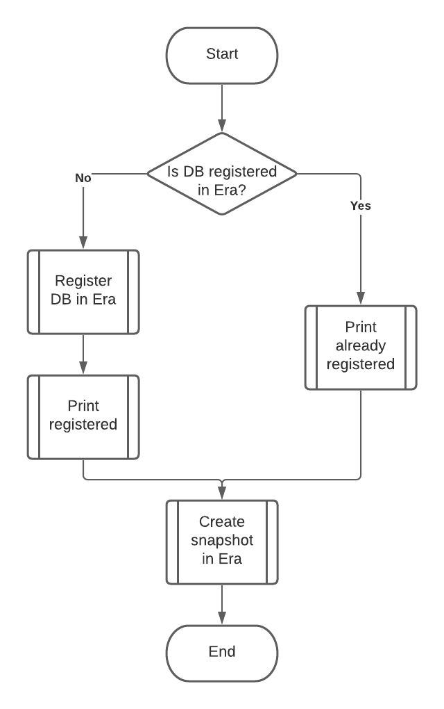

.. _calm_runbook_windows:

------------------------------------------------
Calm: Create Era snapshot MSSQL Database Runbook
------------------------------------------------

*The estimated time to complete this lab is 60 minutes.*

.. note::
   The shown screenshots are examples. There will be some differences in your environment!!!

Overview
++++++++

In this lab, you will create an Endpoint for your deployed Database VM and assign a Calm Runbook for Creating a snapshot of the MSSQL Database in Era to it.

Creating the Endpoint
+++++++++++++++++++++

Runbooks can only be run assigned to Endpoints. These endpoints can be single or multiple VMs. You are going to use your Database VM and assign that as an endpoint for a Runbook.

#. Click on :fa:`bars` **-> Services -> Calm ->** |endpoints|

#. Click **+ Create Endpoint**

#. Provide the following

   - **Name** - *initials*\-mssql
   - **Description** - Optional
   - **Project** - Your Project
   - **Type** - Windows
   - **Target Type** - VMs
   - **Account** - NTNX_LOCAL_AZ
   - **List of VMs** - Select your *initials*\-mssql
   - **Connection Type** - Leave the default
   - **Credential** - Provide the following (click on the text to see the extra fields)

     - **Username** - Administrator
     - **Secret Type** - Password
     - **Password** - Nutanix/4u

   .. figure:: images/9.png
      :align: center

#. Click **Save**

Creating A Runbook
++++++++++++++++++

Now that you have created your endpoint it is time to create the Runbook. Creating a Runbook can consist out of two parts. The first part is to define the logic (steps) and the needed scripts. The second part is to use Variables that are used by the logic.
The Runbook will do the following

Creating the logic
******************

#. Select **Runbooks** in the left hand toolbarto view and manage Runbooks.

#. Click **Create** Runbooks, or **Create your first Runbook** if there are no Runbooks available.
 
   .. figure:: images/1.png

#. Fill out the following fields:

   - **Name** - *Initials*\ **-Create MSSQL Snapshot**
   - **Description** - Something descriptive of your choice
   - **Project** - *Initials*\ **-Project**
   - **Endpoints** - Select your endpoint (xyz-mssql)

   .. figure:: images/2.png

#. Click **Proceed**

#. Click the **+ Add Task** Button

#. Provide the following

   - **Task Name** - FiestaDB registered
   - **Type** - Decision
   - **Script Type** - Powershell
   - **Endpoint (Optional)** - Leave blank   
   - **Credential (optional)** - Add New Credential where

     - **Credential Name** - Administrator
     - **Username** - Administrator
     - **Secret Type** - Password
     - **Password** - Nutanix/4u
     - Click the **Done** Button
   
   - **Script** - Copy and paste the below

     .. include:: check_fiestadb.ps1
         :literal:

#. Under the **False** side (left side of the desicion logic) click **Add task**

#. Provide the following

   - **Task Name** - Register FiestaDB
   - **Type** - Execute
   - **Script Type** - Powershell
   - **Endpoint (Optional)** - Leave blank  
   - **Credential (optional)** - Administrator
   - **Script** - Copy and paste the below

     .. include:: register_database.ps1
         :literal:
        
#. On the True Arrow of the FiestaDB registered decision, click **Add Task**

#. Provide the following

   - **Task Name** - Found FiestaDB in Era
   - **Type** - Execute
   - **Script Type** - Powershell
   - **Endpoint (Optional)** - Leave blank  
   - **Credential (optional)** - Administrator
   - **Script** - Copy and paste the below

     .. code-block:: powershell
         
         Write-Host "Found @@{initials}@@-FiestaDB in Era"

#. Your Runbook should roughly look like this

   .. figure:: images/3.png
      :align: center

#. Click **FiestaDB registered**

#. Click **Add task**

   .. figure:: images/4.png
      :align: center

#. Provide the following

   - **Task Name** - Create Era snapshot
   - **Type** - Execute
   - **Script Type** - Powershell
   - **Endpoint (Optional)** - Leave blank  
   - **Credential (optional)** - Administrator
   - **Script** - Copy and paste the below
 
     .. include:: create_snapshot.ps1
         :literal:

#. Your Runbook should look roughly like this

   .. figure:: images/5.png
      :align: center

#. Click the **Save** in the top right corner.

Setting the Variables
*********************

#. While still being in the Runbook, click the **Configuration** text at the top of the screen

   .. figure:: images/6.png
      :align: center

#. Click on the **Add/Edit Variables** button

#. Click the **+ Add Variable** button

   .. figure:: images/10.png
      :align: center

#. Provide the following

   - **Name** - initials
   - **Data Type** - String
   - **Value** - Leave blank

#. Click the **Add Variable** text in the left hand side of the screen and provide

   - **Name** - era_ip
   - **Data Type** - String
   - **Value** - Leave blank

#. Click the **Add Variable** text in the left hand side of the screen and provide

   - **Name** - era_password
   - **Data Type** - String
   - **Value** - Leave blank
   - **Secret** - Enabled

#. Click the **Add Variable** text in the left hand side of the screen and provide

   - **Name** - era_user
   - **Data Type** - String
   - **Value** - Leave blank

#. Click on all variables the |runningman| icon. That way you can set the variables at Execute time

#. Your variables should look like this

   .. figure:: images/7.png
      :align: center 

#. Click **Done**

#. Click the **Save** button as we want to have the Runbook saved before moving on.

#. Warning is shown, but it is because the password secret is empty. Which is solved as we execute the Runbook.

Execute the Runbook
+++++++++++++++++++

Now that we have all required ready, you are going to execute the Runbook.

#. Still in the Runbook, click **Execute**

#. Provide the following in the fields

   - **Default Endpoint** - This should already mention your *initials*\-mssql
   - **era_user** - admin
   - **era_password** - The password for the admin user
   - **era_ip** - The IP address of your Era instance
   - **initials** - your initials

   .. figure:: images/11.png

#. Click **Execute**

#. This will show the RUnbook and the steps.

#. Click on the **Register FiestaDB**

#. Click the **Output** tab to see the putput of the copied script

   .. figure:: images/12.png

#. Open the Era interface using the IP address of your instance. 

#. Log in with username admin and the corresponding Password

#. Click in the top right corner the **Operations** text

#. Find the process **Register Database** for *initials*\ **-FiestaDB** and click the **Register Database** text. This will show you the details for the task

   .. figure:: images/13.png

#. Wait till the registration has finished. This takes approx. 5-10 minutes

#. Return to your Runbook

#. It is now executing the **Create Era Snapshot** step

   .. figure:: images/14.png

#. Return to **Era -> Operations**

#. Click on the **Create Snapshot** for your Database *initials*\ **-FiestaDB_TM** to see the details

   .. figure:: images/15.png

#. Wait for the process to finish. This will take approx. 2 minutes

#. While still being in Era, click in the upper left corner the **Operations** text and select **Time Machines**

   .. figure:: images/16.png

#. Click under **Name** on your *initials*\ -**FiestaDB_TM**

#. On the left hand side, click **Snapshots**

   .. figure:: images/17.png

#. There should now be a snapshot called **FirstSnapshot_Runbook**

   .. figure:: images/18.png

------

This concludes the Runbook for Windows module

You have now created a Runbook that is telling Era to crete a snapshot of your MSSQL database. Challenge for you is to change the runbook so you can provide the name of the snapshot as a variable. And if your are interested, build a new Runbook where you can restore your FiestaDB using Era.

Both Runbook can be found here, if you are interested in it.

1. Era snapshot name as a variable :download:`Snapshot_Name_Era.json<Snapshot_Name_Era.json>`
2. Era restore snapshot by name, where name is a variable :download:`Restore_Snapshot_Era.json<Restore_Snapshot_Era.json>`

------

Takeaways
+++++++++

- Runbooks can be used to standarize actions using variables
- Runbooks can have defined actions that follow, decisions, executions and even While Loop
- Runbooks are infact encapsulations of scripts that need to run. Based on exit codes (0 or none 0) decisions are made to follow a certain path in the logic
- Scripts in Runbooks are program languages independent. It follows that what is possible of the supported Operation Systems. These languages can be Powershell, Shell command and even higher level program languages like Python and Go.
- The limitations of Runbooks are not the Runbooks themself, but more the person that uses/implements them as well as the Operating System.

.. |proj-icon| image:: ../images/projects_icon.png
.. |mktmgr-icon| image:: ../images/marketplacemanager_icon.png
.. |mkt-icon| image:: ../images/marketplace_icon.png
.. |bp-icon| image:: ../images/blueprints_icon.png
.. |blueprints| image:: ../images/blueprints.png
.. |applications| image:: ../images/blueprints.png
.. |projects| image:: ../images/projects.png

